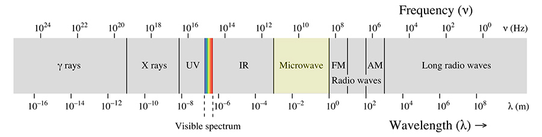
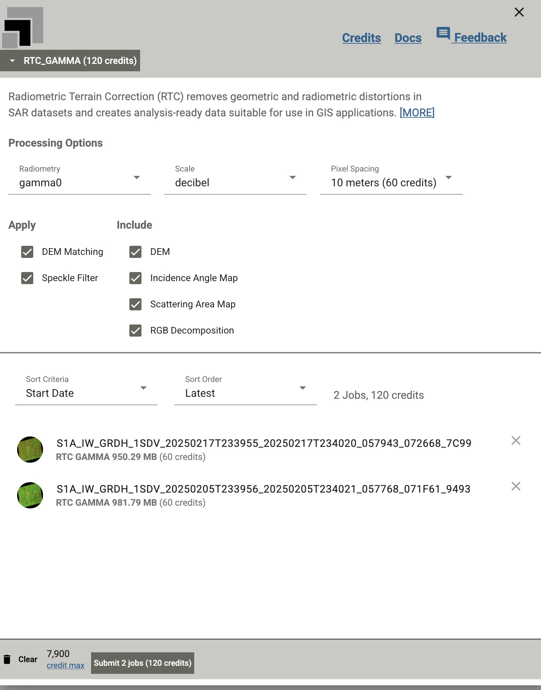

# Creating Near-Real-Time Flood Data with Satellite Imagery


### Project Overview

1. Objective
    - Use Sythetic Aperture Radar (SAR) data from the European Space Agency (ESA) Sentinel-1 satellite to detect flooding in Kentucky from February 2025.

2. Data sources
 - Imagery
    - Acquisition
        - European Space Agency
    - Preprocessing
        - Alaska Satellite Facility [ASF Vertex](https://search.asf.alaska.edu/#/?maxResults=250) Data Search Tool
 - Water Data
    - USGS [Stream Gages](https://opengisdata.ky.gov/maps/44a956e2d58a48cfb2e01b0c127acdec/explore?location=37.827060%2C-85.702407%2C7.15) for Kentucky
    - USGS [Water Services](https://waterservices.usgs.gov/) - Instantaneous Values
 - Python
    - [asf-tools](https://github.com/ASFHyP3/asf-tools/)
    - ASF Python [API](https://hyp3-docs.asf.alaska.edu/tools/asf_tools_api/)
    - [HydroSAR](https://github.com/HydroSAR/HydroSAR/tree/develop)

 ##### SAR is collective in Microwave


**Electromagnetic Spectrum**:  For context, humans observe light in a vary narrow band between 400nm - 700nm.  Microwaves, on the contrary, range in wavelengths of 1mm - 1m.  Sentinel-1 measures radiation in the L-Band microwave - ~23cm.  Because of this, SAR is ideal because it will send signals through the atmosphere (rain, clouds, etc.) unobstructed and return to the satellite sensors.  It's the backscatter that is measured by the satellite.


### Data Collection and Loading

Set up envrionment

- clone  repo
```git
git clone https://github.com/ianhorn/codeky-da-capstone.git 
cd codeky-da-capstone
```

- Create a virtuel environment
```bash
python3 -m venv venv
source venv/bin/activate   # linux/mac
venv/Scripts/Activate.ps1  # windows
```

- Download the [data.zip](https://ky.box.com/shared/static/p7qrt8yfp0eekqybr5317yn6q9oba6l0.zip') file.  Unnzip into the repo's root folder.  *You will want to do this and **NOT** download from the notebook to save time.*  Once unzipped, the pathway should look like this:
```text
CODEKY-DA-CAPSTONE
    - media
    - data
        - crisis_scene_processing
        - dem_processing
        - png_viz
        - S1A_IW_20250217T233955_DVP_RTC10_G_gpufem_0598
    - .gitignore
    - base_granule_README.md
    - CAPSTONE.ipynb
    - crisis_granule_README.md
    - LICENSE
    - Proposal.MD
    - README.md
```

---
### Data Acquisition

#### Determine low and high marks from the stream gage

In order to determine the time frame from which to order data, it's important to consult the water level data.  I did this by obtaining the USGS Gage ID for the stream gage in Frankfort, Ky.  I made a call to the USGS Water Services [dataretrieval](https://doi-usgs.github.io/dataretrieval-python/reference/index.html) API, which returns metadata and a dataframe a gage readings for every 15 minutes of a specified time range.  

Because the API returns a pandas dataframe, I used a *groupby* function to return maximum gage flow and gage height daily values.  This was useful because it made choose an ealier scene than I previously considered.

### Order OnDemand from Alaska Satellite Facility

My original plan was to use a STAC API to query for data by location and date.  However, obtaining raw satellite data and processing into a usable geo-referenced image is very complex.  Fortunately, the [Alaska Satellite Facility](https://asf.alaska.edu/), a NASA Distributed Active Archive Center ([DAAC](https://asf.alaska.edu/asfsardaac/) provides a search tool called [Vertex](https://search.asf.alaska.edu/#/?maxResults=250).  This tool allows a user to easily filter, order, and download data.

For this project, I picked two scenes.  The first granule is from January 24<sup>th</sup> while the second second granule is from February 17<sup>th</sup>.  

Using the Vertex interface, I selected the two scenes I wanted to submit to the queue for Radiometrically Terrain Corrected (RTC) processing.  [RTC](https://hyp3-docs.asf.alaska.edu/guides/rtc_product_guide/) corrects geometric and radiometric distortions inherent in SAR data because of side-looking instrumentation on the satellite.  By providing this service free of charge to subscribed users at 10,000 credits a month, analysts can bypass intense computational processing and use a GIS-ready product.  

Below is an example of the options I used to order two ESA Sentinel-1 scenes from NASA's Alaska Satellite Facility.

<br>
<p align="center">
  
</p><br>

By applying DEM matching, this aligns the scene with the digital elevation model, which provides a ground value for the data.  By applying a speckle filter, the On-Demand processing removes noise.  The end product is a ground range detected (GRD) product at decibel scale.  I chose the decibel scale (not power or amplitude) because it is most suited for detecting water.

*\*note\* I later learned that by selecting this scale, HydroSAR's `make_flood` function wouldn't calculate properly.*  

 ### Exploratory Data Analysis
 - download data (review metadata)
    - Base Scene [README](base_granule_README.md)
    - Crisis Scene [README](crisis_granule_README.md)


#### Visualize the imagery
Once we've download the scenes, or granules, for the project area,  We can create a map to make sure we really have the data we need.  A quick and dirty way to do is just to read in the delivered shapefile and load into the map.

The Geotiffs that come with each granule are 1-2 gb and would require extensive processing to visualize.  Again, in the interest of time I used [GDAL](https://gdal.org) `gdal_translate` to transform the Tiff files into smaller [PNGs](data/png_viz/).

#### Data Cleaning and Preparation
*[HAND](https://registry.opendata.aws/glo-30-hand/)*, or Height Above Natural Drainage, is used to normalize relative heights above a drainage network.  The HAND required to create a flood map must also be a derivative of the Digital Elevation Model used to terrain-correct the satellite imagery, I opted to create my own HAND from the delivered dem instead of downloading and mosaicking multiple tiles from the the hand.geojson file availabe on AWS.  This this process was relatively quick using ArcGIS Pro. Results are copied to the [dem_processing](data/dem_processing/hand) folder.
___
## Create Flood Image

We now have all the elements required to extract flood areas:
 - HAND
 - Flood Scene
 - Water Extent Image

 The formula from HydroSAR simple.<br>
 ```
 make_flood_map(out_raster, flood_scene, hand, water)
 ```

### Analysis and Insights

#### Findings

The flood map created from HydroSAR was surprisingly useful on the surface.  However; I do question the accuracy of my water extent data that was used as input.  I had to create my own water extent map with the OnDemand process data.  

The results may also have to do resolution issue - 10 meters.  Ten meters can be a large amound of area to cover, especially given the heterogenous terrain of Kentucky.  In addition, Sentinel-1 use the C-Band for SAR data, which is better for flatter areas, but does not penetrated forested areas very well like L-Band SAR, which isn't available.
 

### Conclusion and Recommendations

#### Summarize
This project did not advance as I had anticipated.  Reviewing my proposal, I did not acheive what I set out to do.  I did, however, extract flood data which needs more review to validate.  I will say that as time went by, I learned a tremendous amount about how to acquire and process synthetic aperture radar data.  

I also became less intimidated by the process.  The Hyp3 and HydroSAR modules became easier to understand and navigate. I think what I concluded is that python libraries available do not require data that has been highly processed from the OnDemand process.  Next time, I would select my scenes to order or directly download as less processed products that HydroSAR expects.  


